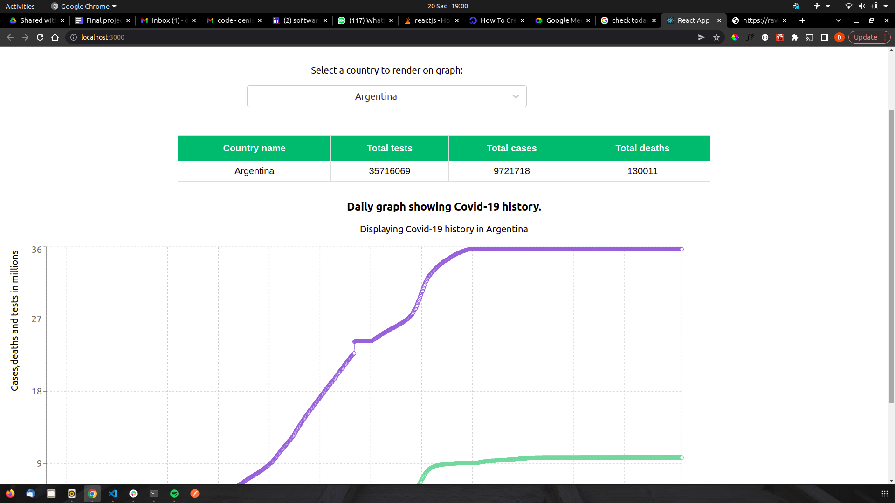

# COVID-19 ANALYSIS SYSTEM

This is an application to analyse covid-19 trends to date. It includes statistics, history and a list of countries available in the application. The app uses react for it's front-end and the Covid-19 api from rapid-api.


## Screenshot
   


## Table of Content

- [Description](#description)
- [Behavior of the website](#siteBehavior)
- [Development and set up](#setUp)
- [Prerequisites](#Prerequisites)
- [Live link](#Live-Link)
- [Technology Used](#technology-Used)
- [Licence](#licence)
- [Authors Info](#Authors-info)

## Description

This is a website displaying Covid-19 statistics in various countries around the world in a table. The app also renders Covid-19 history in a specific country on a graph upon selection.


## Behaviour of the website
### View
+ The website is visually appealing.
+ This is a single page website.
+ Upon loading the application renders Covid-19 statistics of all available countries on a table.
+ By default the app renders Covid-19 history in Afghanistan.
+ On change of selection the app re-renders the graph to show history of the selected country and the table shows statistics in the selected country.


## Development and Setup.

### prerequisites
+ First clone the project to your computer. ```git clone <repo url>``` or move to where the app folder is.
+ Ensure you have text editor such as Vs code installed.
+ Extract the files and open them in the editor.
+ Run npm install to install dependencies.
+ Run npm start to run the react application.


## Technology and Tools Used

+ HTML5
+ CSS5 - styling the application
+ React Js - logic of the application
- Git - Version control
- Vs code- Code editor

